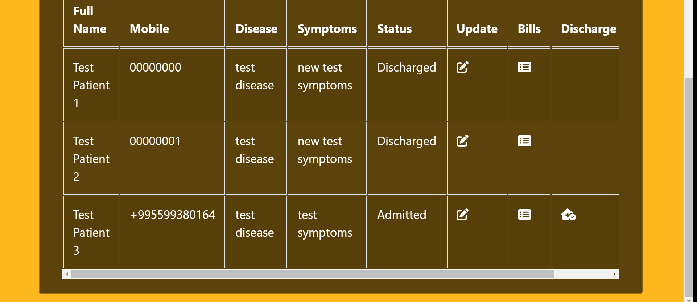

# Hospital Management System (Django REST Framework + React)


---
The web application allows to 3 different types of users to sign in. Each user has access to their designated pages using permissions.

---

## Common Usage

Django REST Framework + React web application allows to:

- register as 3 different types of user: patient, doctor, administrator

- each user can access certain pages using tokens that is genarated during registartion

- tokens are being stored in local storage and in order to logout user has to use log out button

- after login user does not have access to registration and login pages

- administrator has the most diverse access to pages

- administrator gets broad access to content after admin/superuser grants them access from the admin panel

- administrator can add, delete, edit patient and doctors accounts

- administrator can create an appointment

- administrator has access to each patient's bills

- administrator can discharge patient and as result create invoice, if patient has been discharged before administrator does not have access to discharge anymore

- administrator can download all patients, doctors, bills, appointments data in CSV format

- doctor can view list of patients assigned to them and the list as a CSV file

- patient can view list of doctors associated with them, list of bills and invoice if they are discharged

Example of homepage before user signs in


---

## Prerequsites

- Python

- Python Virtual Environment (preferable)

- Git

- Docker

- Node

---

## Common setup

Clone the repo and install the dependencies.

```bash
git clone https://github.com/ana-gujabidze/hospital_management_system.git
cd hospital_management_system/
```

Download Docker Desktop from [the official website](https://docs.docker.com/desktop/). It will automatically install docker compose for you.

Create `.env` file similar to `.env_sample` file and specify all environmental variables for server sides.

---

### Run application locally

If virtual environment is available run the following command

```python
pip3 install -r server/requirements.txt
```

In order to run server successfully, first production build should be created and imported into root directory of the back-end project.

```bash
npm run build
mv build/ ../server/
```

From here server can be started successfully.

First make migrations and then start the server:

```python
python3 manage.py makemigrations

python3 manage.py migrate

python3 manage.py runserver
```

Open [http://127.0.0.1:8000](http://127.0.0.1:8000) in the browser.

Register user as administrator.


After super user confirms user status, administrator can have access to admin dashboard:


Administrator can view the list of patients:



Administrator can update certain fields of patient's profile:


Administrator can discharge user as well and as a result generate invoice:


There is also Swagger UI available for API testing:


Super users and administrators after getting grant from super users have access to admin panel:


---

### Build Images and Run Containers With Docker Client

Navigate to the source directory and from there run command in order to build the image

```bash
docker build -t django-app .
```

After successful build, run the container by the command

```bash
docker run -it -p 8000:8000 --env-file .env django-app
```

After running Django app image, in CLI server URL should appear, after following it, the result should be the following:


